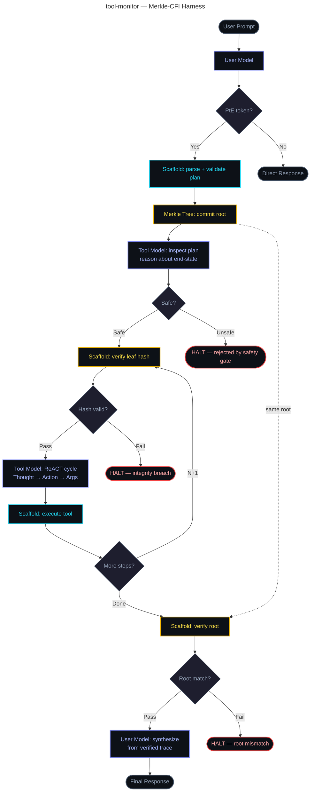

# merkle-cfi-agent

A secure agentic harness using **Merkle-tree Control-Flow Integrity** and a
**Plan-then-Execute** routing pattern. Built as a minimal, readable prototype
for reasoning about LLM agent security.

---

## Getting Started

```bash
python3 -m venv venv
. venv/bin/activate
pip install uv
uv pip install -e .
tool-monitor
```

---

## Core Idea

Standard agentic systems let LLMs drive execution directly — a prompt injection
mid-flight can redirect tool calls arbitrarily. This harness inverts that:

> **The Scaffold owns control flow. LLMs are passive responders.**

A plan is committed to a Merkle tree before execution begins. Every step's hash
is verified _before_ the tool model ever reads it. A tampered node halts the
pipeline immediately. The user model is blind during execution and only receives
the verified trace once all steps complete and the root hash is confirmed intact.

---

## Architecture

```
merkle.py     — SHA-256 Merkle tree (stdlib only, zero deps)
models.py     — Pydantic schemas: Step, Plan, ExecutionRecord
harness.py    — Scaffold class: all orchestration, routing, verification
run.py        — Entry point: config + wiring only
```

## Control Flow



---

## ReACT Format (Tool Model)

Each execution step uses ReACT (Reason + Act):

```
Thought: <reasoning about the step and prior observation>
Action: <tool_name>
Args: <JSON object>
```

The harness parses this, executes the tool from the registry, and feeds the
observation back as context for the next step. The tool model never calls
anything directly.

---

## Setup

```bash
# 1. Clone and install
pip install -e .

# 2. Configure environment
cp .env.example .env
# Edit .env — add your OPENROUTER_API_KEY

# 3. Run
python run.py
# or
merkle-agent
```

---

## Extending

**Add a real tool:** Add a key/callable pair to `TOOLS` in `harness.py`.
The callable receives the `args` dict and returns a string observation.

**Swap models:** Change `USER_MODEL` and `TOOL_MODEL` in `run.py` to any
model string from [openrouter.ai/models](https://openrouter.ai/models).

**Production hardening (not in scope for prototype):**
- Sub-trees for mid-plan pivots
- Deterministic permit lists per tool (path restrictions, call count limits)
- Human-in-the-loop approval gate on Merkle root
- Tainted-data sanitization on tool outputs before re-entering context

---

## Security Properties (Prototype Scope)

| Property | Mechanism |
|---|---|
| Plan immutability | Merkle leaf verification before each step |
| Pre-execution safety check | Separate tool model inspection pass |
| Planner isolation during execution | User model receives no tool outputs mid-run |
| Verified synthesis | User model only gets trace after root confirmation |
| Fail-fast on integrity breach | `IntegrityError` raised immediately, no retry |

---

## Demo Videos

### Safe Execution Flow

A demonstration of a benign task executing through the full pipeline with Merkle verification at each step:

[Watch Safe Execution Demo](./safe.mp4)

### Adversarial Execution Flow

A demonstration showing the system halting early when a potentially dangerous plan is detected by the safety model:

[Watch Adversarial Execution Demo](./adversarial.mp4)

---

## References

- Google for Developers - [How to secure your AI Agents: A Technical Deep-dive](https://www.youtube.com/watch?v=jZXvqEqJT7o)
- Simon Willison - [Design Patterns for Securing LLM Agents against Prompt Injections](https://simonwillison.net/2025/Jun/13/prompt-injection-design-patterns/)
- [From prompt injections to protocol exploits: Threats in LLM-powered AI agents workflows](https://www.sciencedirect.com/science/article/pii/S2405959525001997)
- Fast.io - [How to Set Up an AI Agent Sandbox Environment](https://fast.io/resources/ai-agent-sandbox-environment/)
- Meta AI - [Agents Rule of Two: A Practical Approach to AI Agent Security](https://ai.meta.com/blog/practical-ai-agent-security/)
